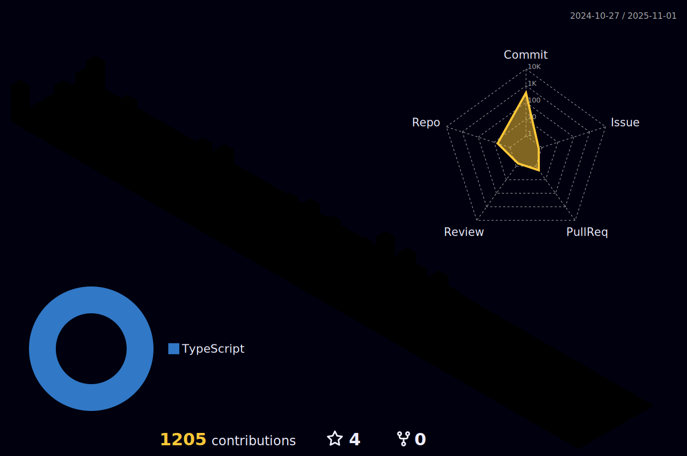

    
 

   
   

 
  
  
  </a>
  

  

###

###
   
   

   
   
    
  
  
  
  
   
   

###

  

  <a href="https://github.com/jeanmbiz">
  
  

   
   
   

      

  
   
   

<h3>"Todos neste país deveriam aprender a programar um computador, pois isto ensina a pensar!" - Steve Jobs<h3/>

